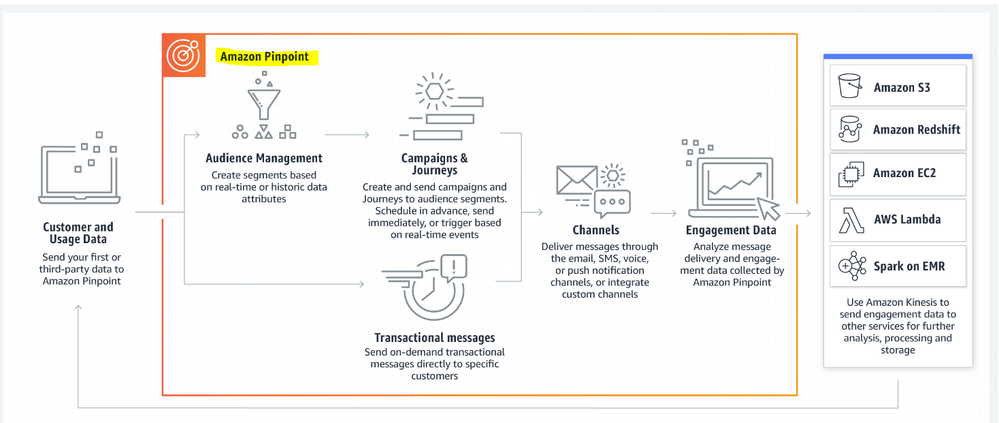

# Amazon Pinpoint & Polly 

# Pinpoint
## Why we use Amazon Pinpoint?
To send push notifications, in-app notifications, emails, text messages, voice messages, and messages over custom channels, so it helps communicate with users.  
  
## What the Benefits?
1. Get started quickly.  
2. Segment and personalize for impact.  
3. Measure your efficiency.  
4. Scale securely with the experts.  

## How it works?
  

# Polly
## What Is Amazon Polly?
A service that turns text into lifelike speech, allowing you to create applications that talk, and build entirely new categories of speech-enabled products.  
## What the Benefits?
1. High quality.  
2. Low latency.  
3. Support for a large portfolio of languages and voices.  
4. Cost-effective.  
5. Cloud-based solution.  
  
Resources:  
[Amazon Pinpoint](https://aws.amazon.com/pinpoint/)  
[Amazon Polly](https://docs.aws.amazon.com/polly/latest/dg/how-text-to-speech-works.html)  