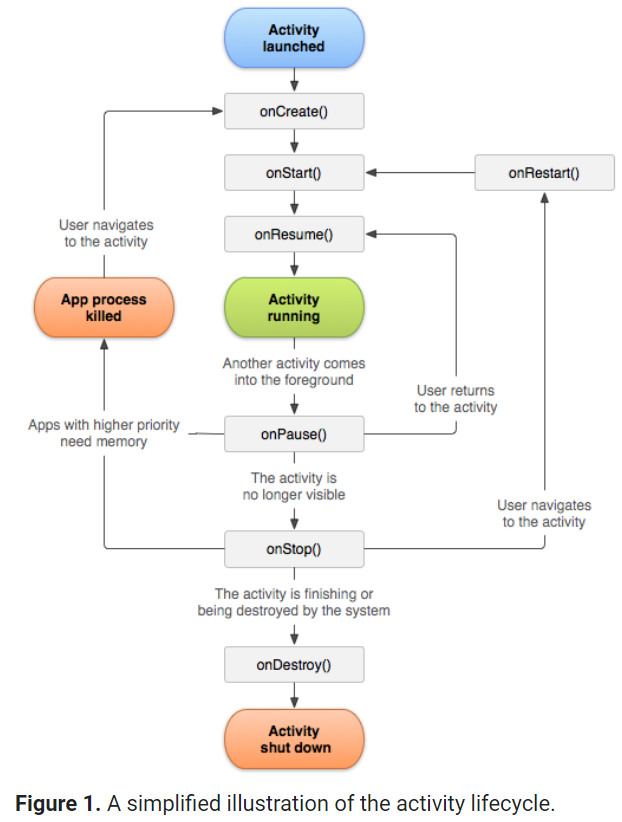
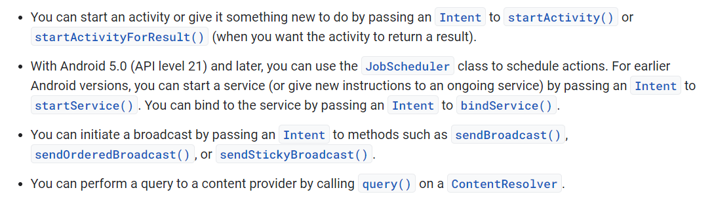

# Android Fundamentals
Android apps can be written using Kotlin, Java, and C++ languages.  
  
## App components 
>1. Activites  
>>It represent the single screen with a user interface
>> The activity lifecycle 
>2. Services  
>> It is a component that runs in the background to perform long-running operations or to perform work for remote processes.  
>> The types of service : 
>> * Started services : tell the system to keep them running until their work is completed.    
>> * Bound Services : the service providing an API to another process.  
>3. Broadcast recivers  
>> Is a component that enables the system to deliver events to the app outside of a regular user flow, allowing the app to respond to system-wide broadcast announcements.  
>4. Content providers  
>> Manages a shared set of app data that you can store in the file system, in a SQLite database, on the web, or on any other persistent storage location that your app can access.  
  
  
## Activating components 
* An intent is created with an Intent object, which defines a message to activate either a specific component (explicit intent) or a specific type of component (implicit intent).  
* There are separate methods for activating each type of component:  
  
  
## The manifest file
* App must declare all its components in this file, which must be at the root of the app project directory.  
* Identifies any user permissions the app requires, such as Internet access or read-access to the user's contacts.  
* Declares the minimum API Level required by the app, based on which APIs the app uses.  
* Declares hardware and software features used or required by the app, such as a camera, bluetooth services, or a multitouch screen.   
* Declares API libraries the app needs to be linked against (other than the Android framework APIs), such as the Google Maps library.  
  