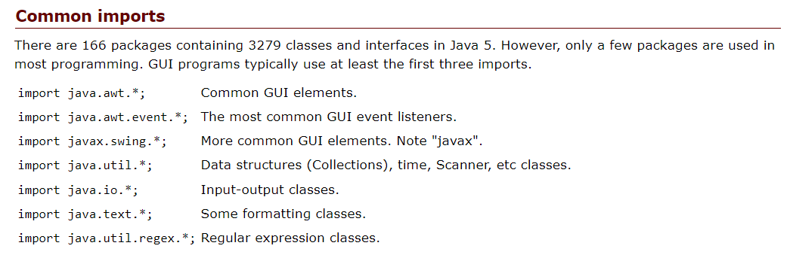

# Array, Loops, Imports  
We use the loop is when we need to execute the code until the condition becomes false.  
The types of loops in Java:
* Simple for loop
> The for loop allows us to repeat certain operations by incrementing and evaluating a loop counter.  
>> for (initialization; Boolean-expression; step){   
    //execute the Code  
}  
* Labeled for Loops  
> we can use it when we have a nested for loops and we need to break or contiunue from a specific for loop.  
>> label1: for (initialization; Boolean-expression; step){   
    //execute the Code
    Label2: for (initialization; Boolean-expression; step){   
          //execute the Code2 
          break Label1; // it will stop the first for loop 
     }   
}  
* Enhanced for-each loop  
>We use it when we have an array or a collection(List,Map,Set).  
>> for(Type item : items)  
  {
      //Code
  };  
* Iterable.forEach()
>Perform the given action for each item untill the all items processed.  
>> items.forEach(item -> System.out.println(item));  
* While loop  
>Execute the code until the condition become false.  
>> while (condition) {  
  // code block to be executed while the condition is true  
}   
* Do-While loop  
>It is like the wile loop, but the only different is that the do-while loop execute the code once then check the condition.  
>>do {  
  // code block to be executed at least once and while the condition is true    
} while (expression);  

# Packages and Import
>**What is the package?** 
>>It something like orgnize the code, put the related classes in the same package.
>**How we use this pacakge?**  
>>By package decliration **package** and then **import** it.  
>**How we can Import the pacakge?**  
>>We can use( * ) to make all classes in the pacakge are available  to use in the programe or import the specific class which we want to use. And we can fully qualified class name without an import.  
<!-- taken from https://perso.ensta-paris.fr/~diam/java/online/notes-java/language/10basics/import.html-->
