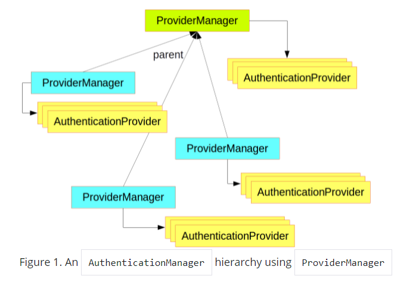
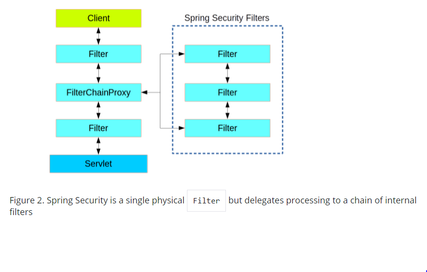
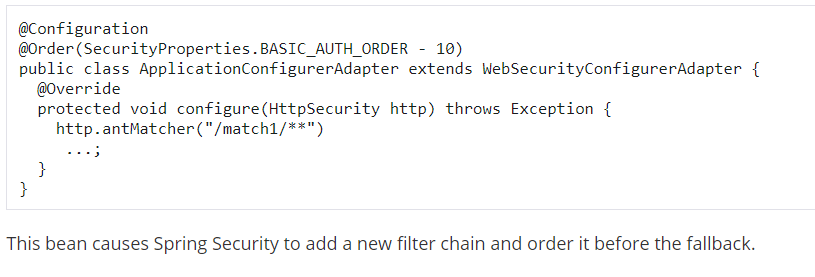
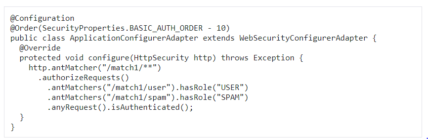

# Spring Authentication
## Spring Security Architecture 
### Authentication and Access Control
Application security are :   
1. authentication : who are you?  
>The main strategy interface for authentication is **AuthenticationManager**, which has only one method:  
>
>public interface AuthenticationManager {  
>
> Authentication authenticate(Authentication authentication)  
>    throws AuthenticationException;  
>}  
>An AuthenticationManager can do one of 3 things in its authenticate() method:  
>
>Return an Authentication (normally with authenticated=true) if it can verify that the input represents a valid principal.  
>
>Throw an AuthenticationException if it believes that the input represents an invalid principal.  
>
>Return null if it cannot decide.  
>An **AuthenticationProvider** is a bit like an AuthenticationManager, but it has an extra method to allow the caller to query whether >it supports a given Authentication type:  
>
>public interface AuthenticationProvider {  
>
>	Authentication authenticate(Authentication authentication)  
>			throws AuthenticationException;  
> 
>	boolean supports(Class<?> authentication);  
>}   
>  

2. Authorization : what are you allowed to do ?  
>An **AccessDecisionVoter** considers an Authentication (representing a principal) and a secure Object, which has been decorated with > ConfigAttributes:  
>
>boolean supports(ConfigAttribute attribute);  
>
>boolean supports(Class<?> clazz);  
>
>int vote(Authentication authentication, S object,  
>        Collection<ConfigAttribute> attributes);  

### Web Security
  
* How Creating and Customizing Filter Chains ?  
  
* How to decide whether to apply a security filter chain to an HTTP request ?  
  

