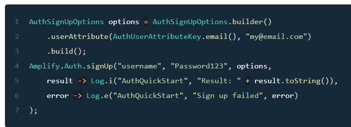
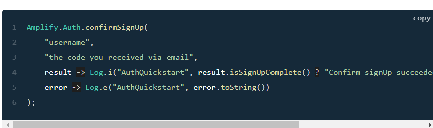
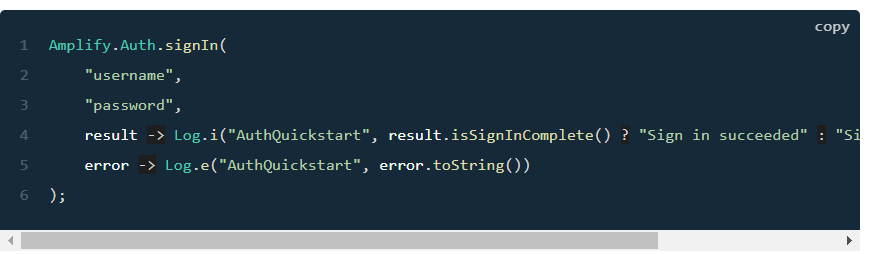

# Cognito

## Getting Started
1. Configure Auth Category
Run **amplify add auth** command in the project directory. And execut the command by **amplify push**.  
  
2. Install Amplify Libraries
Add **implementation 'com.amplifyframework:aws-auth-cognito:1.35.4'** in build.gradle file.  
  
3. Initialize Amplify Auth
Add this line, to include the Auth plugin.  
Amplify.addPlugin(new AWSCognitoAuthPlugin());  
Amplify.configure(getApplicationContext());    
  
## Register a user
1. Register a user.  
* Invoke the following api to initiate a sign up flow.  
  
* Confirm the user: you will recieve a confirmation code.  
  

## Sign in a user
  

Resources:  
[Amplify and Cognito_Getting Started and SignIn](https://docs.amplify.aws/lib/auth/getting-started/q/platform/android/)