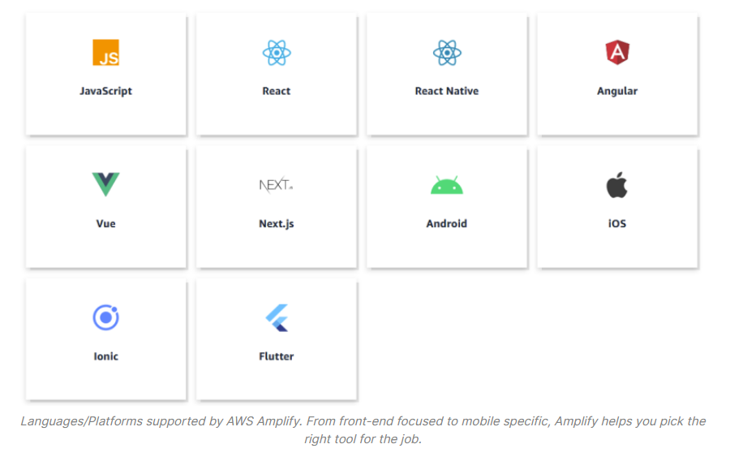
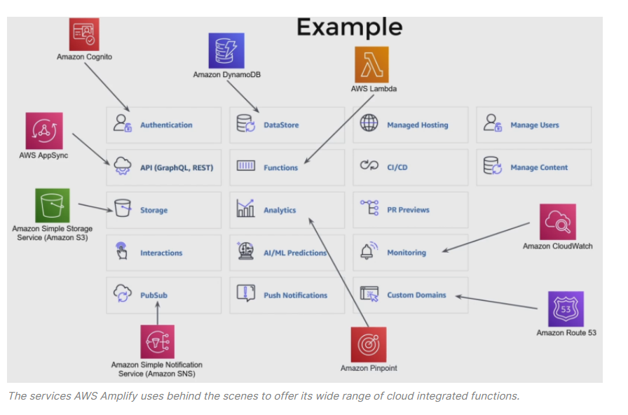
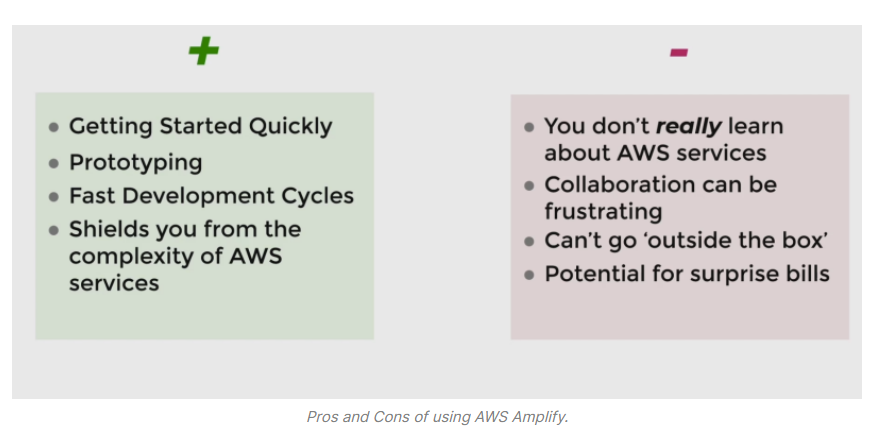

# What is AWS Amplify?
* AWS Amplify is a toolchain that helps you build and deploy entire applications very quickly.  
* Languages supported by AWS:  
  
* Amplify is an attractive tool because it allows developers to add application functionality( like Storage, Authentication, Monitoring, and PubSub functionalities.) without having to know what AWS services to use to achieve that functionality.   

# Amplify Features
  
  
# Usage
* Command Line Interface (CLI) : The CLI is a library that you can install to your terminal to interact with the library.  
* Admin UI

# Pros and Cons of Amplify
  
