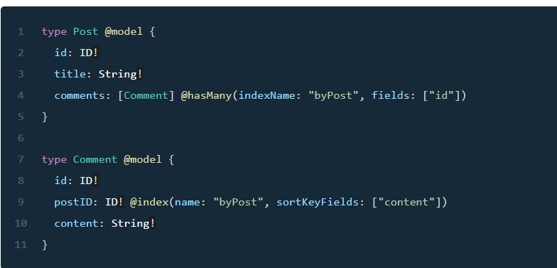

# GraphQL @connection
### Has Many relationship
* Create a one-directional one-to-many relationship between two models using the @hasMany directive.  
* @hasMany configures a secondary index on the related table to enable you to query the related model from the source model.  
  
  
### CompletableFuture
<!-- Read https://www.callicoder.com/java-8-completablefuture-tutorial/ -->
* CompletableFuture is used for asynchronous programming in Java. Asynchronous programming is a means of writing non-blocking code by running a task on a separate thread than the main application thread and notifying the main thread about its progress, completion or failure.  
* Using CompletableFuture as a Simple Future 
- we can create an instance of this class with a no-arg constructor to represent some future result.   
- CompletableFuture is an extension to Java’s Future API which was introduced in Java 5.  
A Future is used as a reference to the result of an asynchronous computation. It provides an isDone() method to check whether the computation is done or not, and a get() method to retrieve the result of the computation when it is done.  
- If we already know the result of a computation, we can use the static completedFuture method with an argument that represents a result of this computation.  

Resources:  
[One-to-many and many-to-one connections using GraphQL in AWS Amplify (only read the “Has Many relationship” section)](https://docs.amplify.aws/cli/graphql/data-modeling/#belongs-to-relationship)  
[CompletableFuture in Java (only read through section 3)](https://www.baeldung.com/java-completablefuture)  
[Java CompletableFuture Tutorial with Examples](https://www.callicoder.com/java-8-completablefuture-tutorial/)