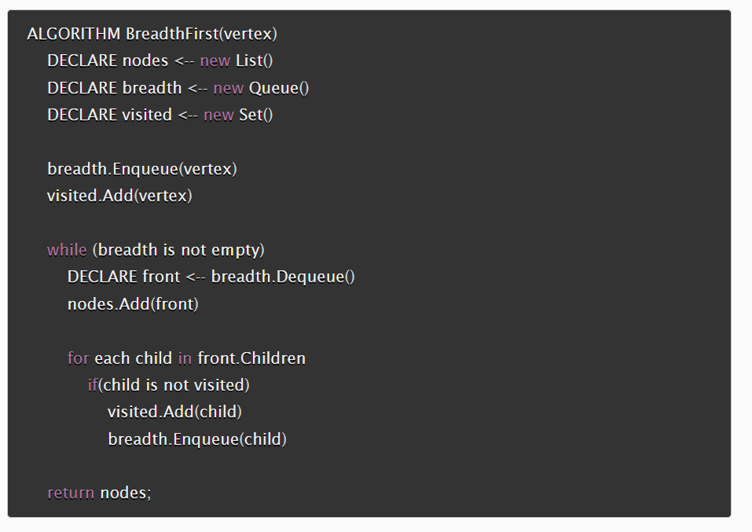
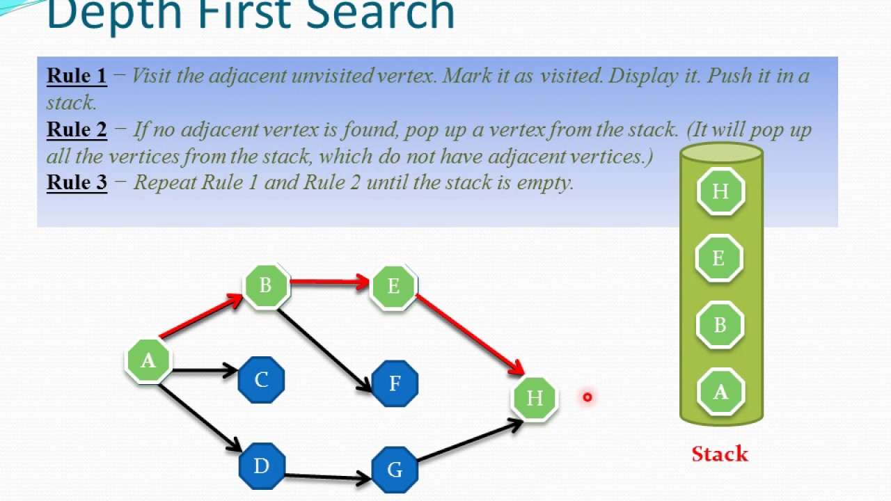

# Graphs
A non-linear data structure that can be looked at as a collection of vertices (nodes) potentially connected by line segments named edges.  
The neighbors of the node called *Neighbor*.  
The number of edges connected to the vertex called *Degree*.  
  
### Directed(Digraph) vs Undirected
* The undirected graph does not move in any direction.  
* The Digraph has arrows pointing to specific nodes(the node has next).  

### Complete vs Connected vs Disconnected
* **Complete Graphs**: when all nodes are connected to all other nodes.  
* **Connected**: each node is connected to at least one other node or vertices.  
* **Disconnected**: where some vertices may not have edges.  
  
### Acyclic vs Cyclic
* **Acyclic**(DAG): directed graph without cycles, not going back to the start vertex.  
* **Cyclic**: the graph that has cycles, starts and ends at same vertex.  
  
## Graph Representation
> 1. **Adjacency Matrix**  
>> represented through a 2-dimensional array.  
>> Each Row and column represents each vertex.  
>> We put 1 as element if there is an edge connects the two vertex, and 0 if there is not.  
>> a **sparse** graph is when there are very few connections. a **dense** graph is when there are many connections  
  
> 2. **Adjacency List**  
>> represented through a linked lists or array that lists all of the other vertices that are connected.  
  
### Weighted Graphs
When the graph has numbers assigned to its edges.  
We represent the graph as a Matrix by putting  the weight for the edge in the matrix instead of the 1.  
We represent the graph as a List by include both the weight and the name of the adjacent vertex.  
  
## Traversals
1. Breadth First  
  
2. Depth First  
  
  
Resources:  
[Graphs](https://codefellows.github.io/common_curriculum/data_structures_and_algorithms/Code_401/class-35/resources/graphs.html)    
   