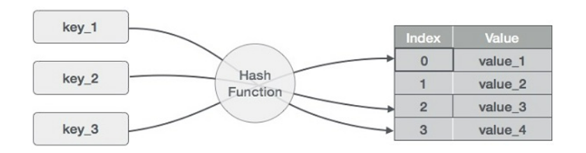
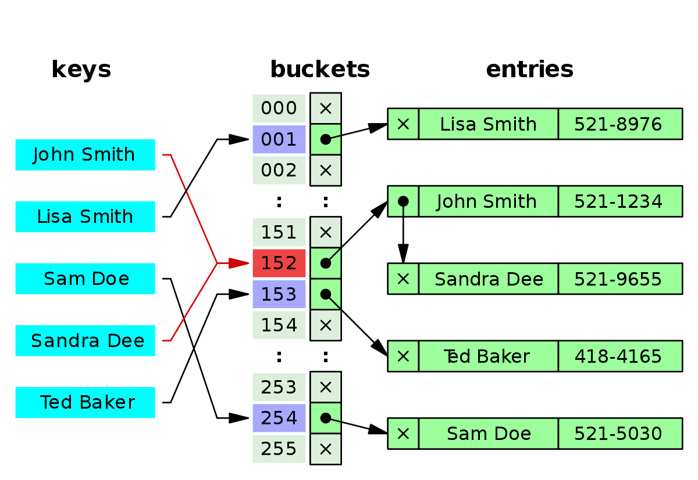

# Hash Tables
## What is a Hashtable?
Is a data structure that the data is stored in an array format, where each data value has its own unique index value. Access to data becomes very fast if we know the index of the desired data.  
<!-- https://www.tutorialspoint.com/data_structures_algorithms/hash_data_structure.htm -->
  

## How find the key index?
Define a hashing method to turn that “key” into a numeric number value.  

## When do the Collisions happen?
* A collision occurs when more than one key hashes to the same index in an array.   
* Collisions are solved by changing the initial state of the buckets. Instead of starting them all as null, we can initialize a LinkedList in each one.  
  
## Internal Methods
1. Add()  
* send the key to the GetHash method to determine the index.
* Check if something exists at that index already, if it doesn’t, add it with the key/value pair. If something does exist, add the new key/value pair to the data structure within that bucket.  
2. Find()  
* The Find takes in a key, gets the Hash, and goes to the index location specified. Once the index location is found in the array, it is then the responsibility of the algorithm the iterate through the bucket and sees if the key exists, and return the value.  
3. Contains()  
* The Contains method will accept a key, and return a bool if that key exists inside the hashtable. The best way to do this is to have the contains call the GetHash and check the hashtable if the key exists in the table given the index returned.  
4. GetHash()  
* The GetHash will accept a key as a string, conduct the hash, and then return the index of the array where the key/value should be placed.  

Resources:  
[Intro to Hash Tables](https://codefellows.github.io/common_curriculum/data_structures_and_algorithms/Code_401/class-30/resources/Hashtables.html)  
[what is a hash table?](https://www.youtube.com/watch?v=MfhjkfocRR0)   
[basics of hash tables](https://www.hackerearth.com/practice/data-structures/hash-tables/basics-of-hash-tables/tutorial/)  
[Data Structure and Algorithms - Hash Table](https://www.tutorialspoint.com/data_structures_algorithms/hash_data_structure.htm)
