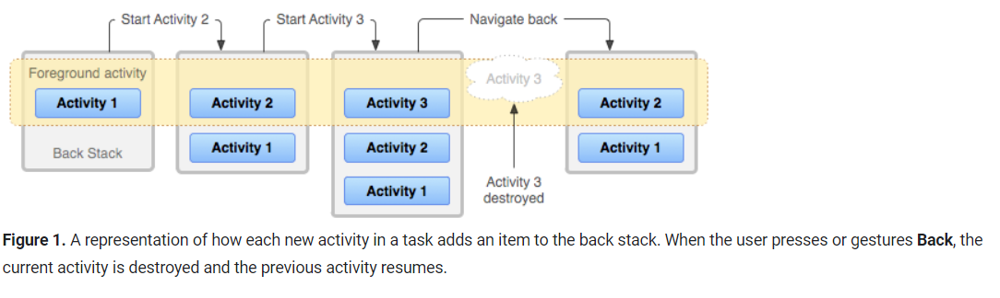
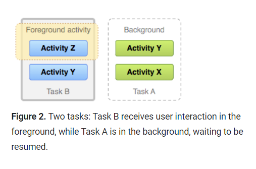
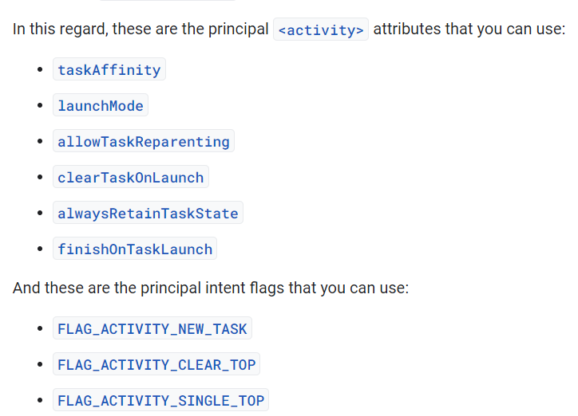
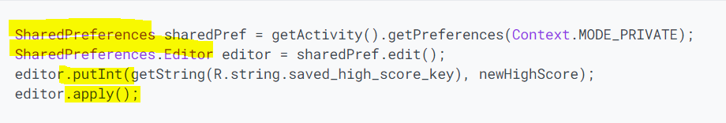
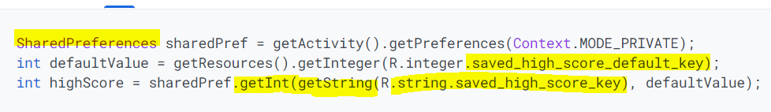

# Intents, Activities, and SharedPreferences

## Tasks and the back stack 
The task is a collection of activities the user interacts with when using the app. When one activity is opened then this activity goes into the back stack. And when the user goes back from this activity it will popped off the stack.

### Lifecycle of a task and its back stack
  
  
>* **Back press behavior for root launcher activities**
>> It depends on the android version :  
>> 1. System behavior on Android 11 and lower : the system finishes the activity.  
>> 2. System behavior on Android 12 and higher : the activity and its task move to the background insted of finishing the activity.  
  
> * **Background and foreground tasks**  
>>   
    
> * **Multiple activity instances**  
>> single activity is instantiated multiple times in the back stack, because the activities are never rearranged.  
  
> * **Multi-window environments**  
>> When apps are running simultaneously in a multi-windowed environment, supported in Android 7.0 (API level 24) and higher, the system manages tasks separately for each window.  

### Manage tasks  
If you want to interrupt the normal behavior for the tasks and the back stack then you can use attributes in the <**activity**> manifest element and with flags in the intent that you pass to **startActivity()**.  
  
  
## Save key-value data 
Use the **SharedPreferences** APIs to store and retrieve simple values.  
  
* **Get a handle to shared preferences**  
We Use **getSharedPreferences()** or **getPreferences()** Methods to create or access shared preference file.  

* **Write to shared preferences**  
  

* **Read from shared preferences**  
  
        
Resources:  
[Android Tasks and the Back Stack](https://developer.android.com/guide/components/activities/tasks-and-back-stack)  
[Android SharedPreferences](https://developer.android.com/training/data-storage/shared-preferences)