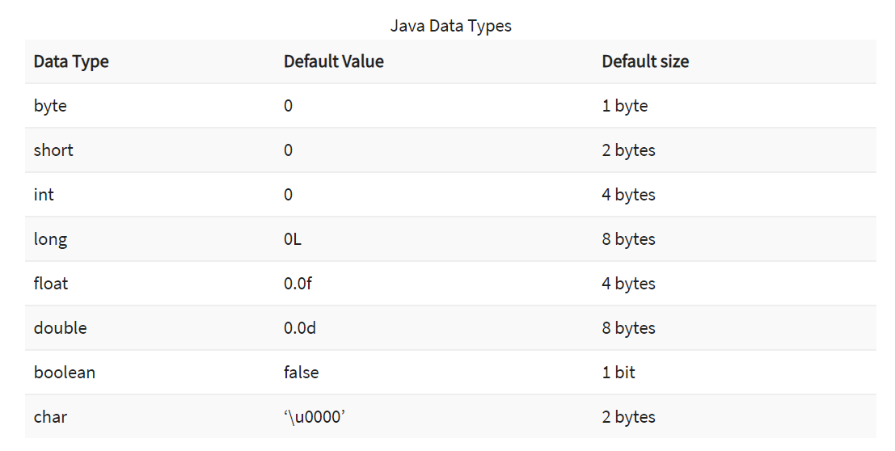

# Java Basics  
The Java programming language defines the following kinds of variables:  
* Instance Variables (Non-Static Fields)  
* Class Variables (Static Fields)  
* Local Variables  
* Parameters  

## Primitive Data Types
<!-- taken from https://www.guru99.com/java-variables.html -->
>   

## Arrays
> An Array is an object containes a fixed number of values of same data type  

> To declare an array must determine the type of this array with [] and the name of that array.  
Type [] ArrayName; OR  
Type[] ArrayName = new Type[arraySize];
> To create an array ArrayName = new Type[arraySize].  
> And we can initilize the values inide the array by the index.  
ArrayName[0] = "" ; 

Note : to create and initialize an array:  
Type[] ArrayName = {Value1,Value2, ... };  

>To Copy an Array:  
we can use **arraycopy** Method from **System** Class:  
<!-- taken from https://www.tutorialspoint.com/java/lang/system_arraycopy.htm -->
  

> Some other useful operations provided by methods in the java.util.Arrays class are:
<!-- taken from https://docs.oracle.com/javase/tutorial/java/nutsandbolts/arrays.html -->
* Searching an array for a specific value to get the index at which it is placed (the **binarySearch** method).  
* Comparing two arrays to determine if they are equal or not (the **equals** method).  
* Filling an array to place a specific value at each index (the **fill** method).  
* Sorting an array into ascending order. This can be done either sequentially, using the **sort** method, or concurrently, using the **parallelSort** method introduced in Java SE 8. Parallel sorting of large arrays on multiprocessor systems is faster than sequential array sorting.  
* Converting an array to a string. The **toString** method converts each element of the array to a string, separates them with commas, then surrounds them with brackets. For example: Arrays.toString(copyTo));  

## Operators
<!-- taken from https://docs.oracle.com/javase/tutorial/java/nutsandbolts/operators.html -->
> Assignment, Arithmetic, Unary , Relational, Equality, Conditional, Bitwise and Bit Shift Operators  

  

## Control Flow Statements
> **The if-then and if-then-else Statements**  
  
if (condition) {  
  // block of code to be executed if the condition is true  
}else{  
      // block of code to be executed if the condition is false  
}  
  
> **The switch Statement**  
    
switch(expression) {  
  case x:  
    // code block execute if the case match with expression  
    break;  
  case y:  
    // code block execute if the case match with expression  
    break;  
  default:  
    // code block execute if there is no case match with expression  
}  

> **The while and do-while Statements**   
    
while (condition) {  
  // code block to be executed while the condition is true  
}  

do {  
  // code block to be executed at least once and while the condition is true    
} while (expression);  

> **The for Statement**  
  
for (initialization; condition ; increment) {  
    // code execute while condition is true  
}  
  
* ### Branching Statements :  
> * The **break;** Statement : to Stop the loop.
> * The **continue;** Statement : to skip the code after it.  
> * The **return** Statement : to return a value for a method.  

