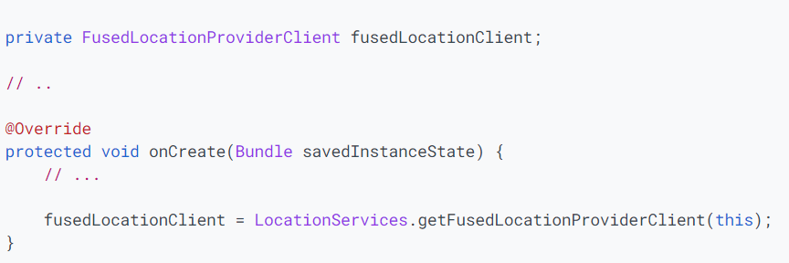
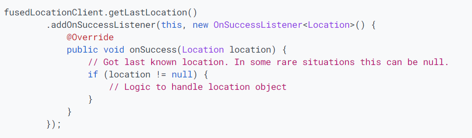

# Kinesis
## Get the last known location 

### How to make a single request for the location of a device using the getLastLocation() method in the fused location provider
1. **Set up Google Play services**  
Download and install the Google Play services component and add the dependency to the project.  
2. **Specify app permissions**  
Request the location permission.  
3. **Create location services client**  
  
4. **Get the last known location**  
  

Resources:  
[Location](https://developer.android.com/training/location/retrieve-current)
