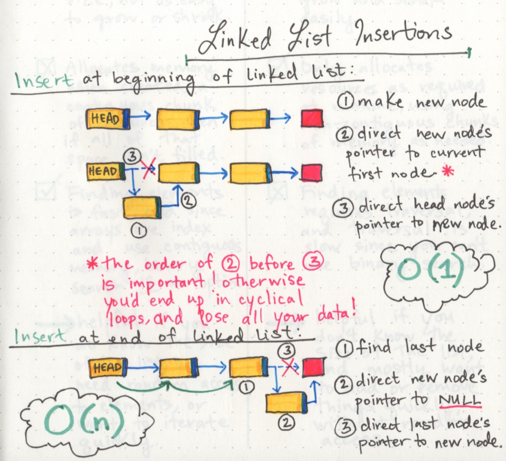

# Linked List  
>> ## What is a Data Structure in Java?  
> A data collection with well-defined operations and behavior or properties. A data structure is a unique way of storing or organizing the data in computer memory so that we can use it effectively.
  

>> ## What the Type of Data Structure
> * Liner Data Structure: elements are sequential, each element connect with the next and previous one except the first and last element they are connect to either next / previous.   
> * Non Liner Data Structure : elements are non-sequentially.  
  

>>## Parts of a linked list  
>A linked list is made up of a series of nodes, which are the elements of the list.The First node is a **Head** and the last node always point to the Null.  
The **Current** variable will tell us where  we are exactly in the linked list.  
So we can do while loop until the next pointer become null that means that the end of the Linked List.  

>>## The Type of the Linked List  
> * Singly Linked List : where the nodes are go in one direction.  
> * Doubly Linked List : Each Node reference to the Next and Previos.  
> * Circular Linked List : The last node doesn't point to null,And the start of the linked list is a **tail** node then the first node.
  

>>## Inserting elements at the beginning and end of a linked list  
>In the Linked List we don't need to copy and re-create our linked list like the Array.We just need rearrange our pointers in the nodes and add/delete the elements.
  

# Big O: Analysis of Algorithm Efficiency 
The BigO(n) notation is used to describe the **time**(the time needs to complete) and **space**(memory used) efficiency 

