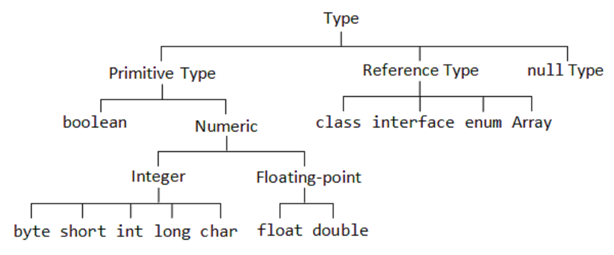
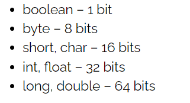
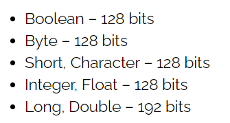
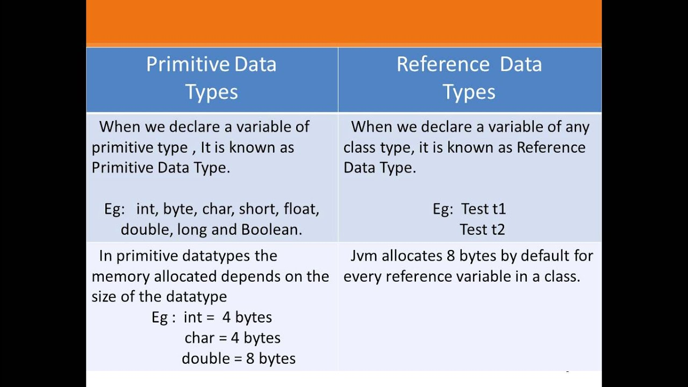
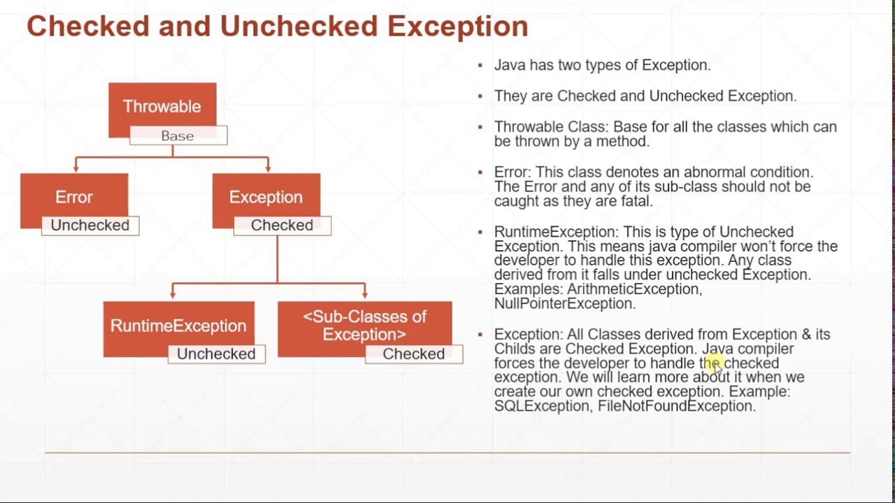

# Maps, primitives, File I/O  

## Primitives  
Java has a two-fold type system consisting of: 
     

* Primitives types (int, boolean,double..)
     

* Reference types(Integer, Boolean,Double..).There are three kinds of reference types: class types, array types, and interface types.
     

**The main difference between the two types** is that primitive types store actual values but reference type stores handle objects in the heap.  

   

# Exceptions in Java   
It is an event, which occurs during the execution of a program, that disrupts the normal flow of the program's instructions.  
the Exception is an object created when the error happen during execution the program,and from this object we can get information about that error happened.
>How we can **Catch** the Exception?  
>* A **try, catch(ExceptionType name), and finally blocks** statement that catches the exception.  
>* Add a **throws** clause to the method declaration.  
What are the Types of the Exceptions ?  
   

## File I/O
The Java platform provides the scanner API which breaks input into individual tokens associated with bits of data.  
<!-- taken from https://www.java67.com/2012/11/how-to-read-file-in-java-using-scanner-example.html  -->
Scanner is a utility class in java.util package and provides several convenient methods to read int, long, String, double etc from a source which can be an InputStream, a file, or a String itself.

>How we can Scanner to read in a file in Java: 
> Scanner has method like **.hasNextLine()** to check if there is a line to read and **.nextLine()** which is read the line from the file.So we can keep read lines until it return null that means this is the end of the file. 

Also,we can read the file using BufferReader. 

