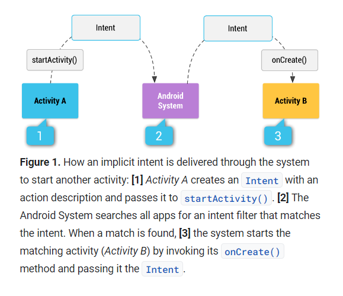
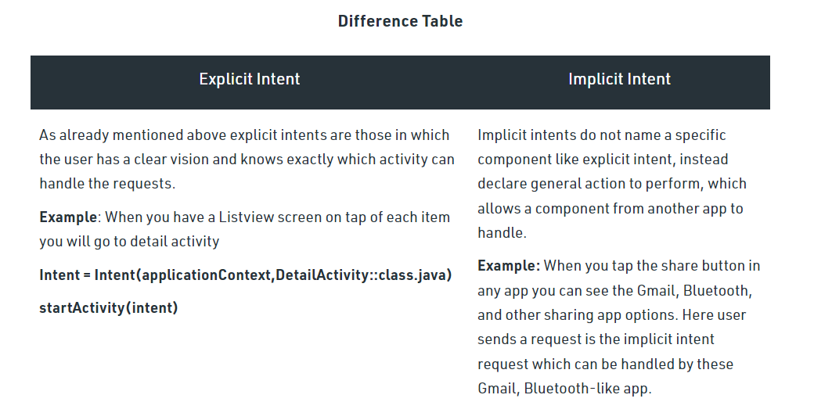
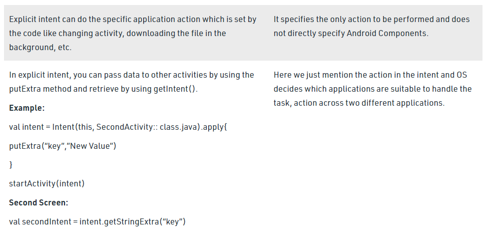
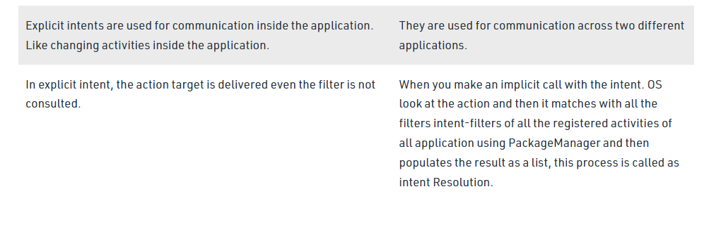

# Notifications

## Allowing Other Apps to Start Your Activity 
In some Applications when we need to share, the app appears as an option in the chooser dialog.  
We need to add an **<intent-filter>** element in the manifest file for the corresponding <activity> element.  
And for the **intent-filter** can specifies only one action and one data type.  
  
## Intent types
1. Explicit Intents: Android calling one activity from another activity and pass information.  
2. Implicit Intents: doesn’t specify the component.  
  

**The Difference Between Explicit and Implicit Intents**  
  
  
  

Recourses:  
[Intent Filters](https://developer.android.com/training/basics/intents/filters)  
[Implicit vs. Explicit Intents](https://developer.android.com/guide/components/intents-filters#Types)  
[Difference Between Implicit Intent and Explicit](https://www.geeksforgeeks.org/difference-between-implicit-intent-and-explicit-intent-in-android/)    