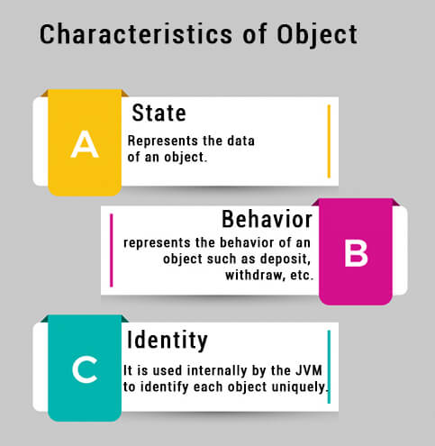

# OOP

## Java Object and Class ( Java is an object-oriented programming language )
  
> What is the **object**
>> Software objects are often used to model the real-world objects, and it is a member (also called an instance) of a Java class.  
>> Each object has an identity, a behavior and a state. The state of an object is stored in fields (state variables), while methods (functions,behaviors) display the object's behavior.  
  

**Example**  
  

> What is the **Class**
>> A class is the blueprint from which individual objects are created.  
>>  It contains the set of fields,constructors,and methods that are common to all objects of one type.  
  

**The Whole Idea**  
  
  

## Binary, Decimal and Hexadecimal Numbers  
For counting we can use different number system.Each Number System has a number of Digit can use to represent the numbers.  

  

