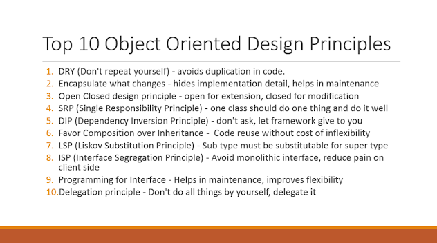
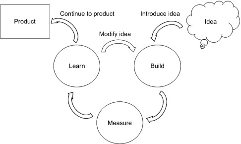
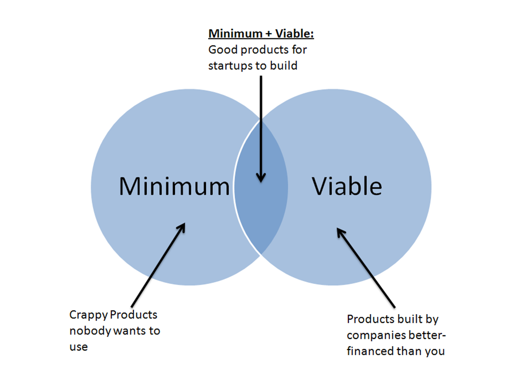
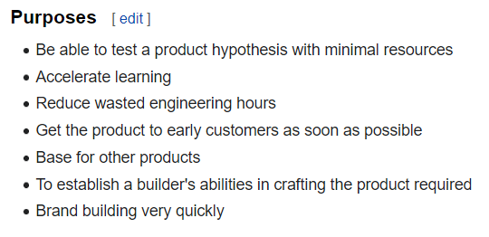

## OO Design  
Object-oriented design is the process of planning a system of interacting objects for the purpose of solving a software problem.  
  
  
### Rule of three (computer programming)  
It means the code must not duplicates more than two time, this duplication is considered bad practice because if you need to change any thing it will take a lot of effort and time.  

### You aren't gonna need it
Don’t add functionality until you need it. Do the functionality which you can use it several time.  

### Minimum viable product  
A minimum viable product (MVP) is a version of a product with just enough features to be usable by early customers who will test this product and then can provide feedback for future product development. This help us to not build product the user doesn’t want and like it So we don’t spend a lot of money and waste time.
   
  
 

* Purpose of MVP :  
<!-- https://en.wikipedia.org/wiki/Minimum_viable_product  -->
  

