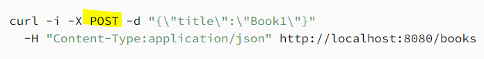

# Related Resources and Integration Testing  

## One-to-Many Relationship  
A one-to-many relationship is defined using the **@OneToMany** and **@ManyToOne** annotations and can have the optional **@RestResource** annotation to customize the association resource.  
[Source_Example](https://www.baeldung.com/spring-data-rest-relationships)  
In the example there is a Library which is a OneToMany To the Lisy of Books and Book Entity which is ManyToOne Library.   
  
### The Association Resources :  
* In order to add instance  
   
* Associate the instance   
    
* Verify the books  
  
* Remove an association  
  
  
## Integration Testing in Spring  
We need the Testing for verifying the end-to-end behavior of a system.  
  
What dependencies we need for running the test?  
* junit-jupiter-engine  
* junit-jupiter-api  
* Spring test  
* Hamcrest  
* JSON path  
  
How to configure and run the Spring enabled tests?  
1. Enable Spring in Tests With JUnit 5  
> * By adding the @ExtendWith annotation to our test classes and specifying the extension class to load  
> * @ContextConfiguration annotation to load the context configuration and bootstrap the context that our test will use.  
> * @WebAppConfiguration, which will load the web application context.  
2. The WebApplicationContext Object  
> wire the web application context right into the test by @Autowired annotation.  
3. Mocking Web Context Beans  
>  It encapsulates all web application beans and makes them available for testing.  
>   
4. Verify Test Configuration  
>   
  
How we can test resource methods using the MockMvc object?  
1. Verify View Name  
  
2. Verify Response Body  
  
3. Send GET Request With Path Variable  
  
4. Send GET Request With Query Parameters  
    
5. Send POST Request  
  

  
Resources:  
[Related data in Spring (only read section “3. One-to-Many Relationship”)](https://www.baeldung.com/spring-data-rest-relationships)  
[Baeldung: Spring Integration Testing](https://www.baeldung.com/integration-testing-in-spring)  

