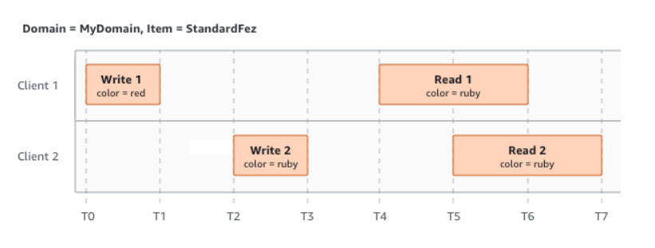
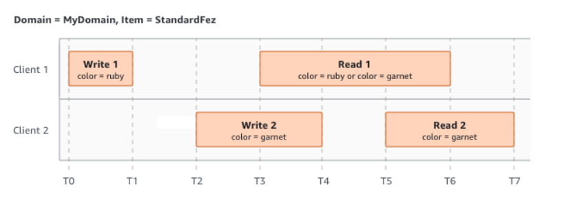
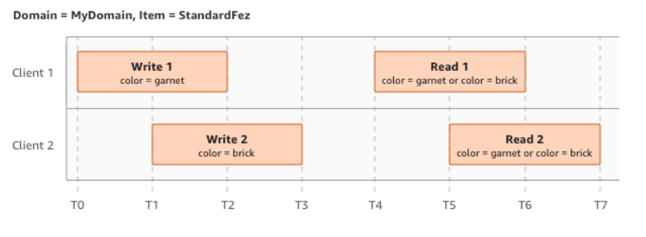

# Amazon Simple Storage Service (Amazon S3) 
* Used to store and protect any amount of data.  
* Provides management features so that you can optimize, organize, and configure access to your data.  
  
## Features of Amazon S3
1. Storage classes: Amazon S3 offers a range of storage classes designed for different use cases.  
2. Storage Management: to manage costs, meet regulatory requirements, reduce latency, and save multiple distinct copies of your data for compliance requirements.  
The features: S3 Lifecycle, S3 Object Lock, S3 Replication, S3 Batch Operations.  
3. Access management: you can auditing and managing access to your buckets and objects. By default, S3 buckets and the objects in them are private.  
The features: S3 Block Public Access, AWS Identity and Access Management (IAM), Bucket policies, Amazon S3 access points, Access control lists (ACLs), S3 Object Ownership, Access Analyzer for S3.  
4. Data processing: To modify and process the data.  
The features: S3 Object Lambda, Event notifications.  
5. Storage logging and monitoring: we can use Automated or Manual monitoring tools to monitor and control how the Amazon S3 resources are being used.  
6. Analytics and insights: to help you gain visibility into your storage usage.  
The features: Amazon S3 Storage Lens, Storage Class Analysis, S3 Inventory with Inventory reports.  
7. Strong consistency: provides strong read-after-write consistency for PUT and DELETE requests of objects in your Amazon S3 bucket in all AWS Regions.  

## How Amazon S3 works
* Store the data as objects within the buckets.  
* Create a bucket, then upload the object which has a unique key to that bucket.  

## Amazon S3 data consistency model
If multiple clients are writing to the same items:  
1. Both write 1 and write 2 finish before the start of Read 1 and Read 2.  
  
2. Write 1 does not finish before the start of Read 1. 
  
3.  Write 2 begins before Write 1 has received an acknowledgement.  
  
  
## Related services
You can use S3 with other AWS services:  
Amazon Elastic Compute Cloud (Amazon EC2), Amazon EMR, AWS Snow Family, AWS Transfer Family.  
  

## Accessing Amazon S3
Using:  
AWS Management Console, AWS Command Line Interface, AWS SDKs, Amazon S3 REST API.  

# Getting Started
1. command **amplify add storage**.  
2. command **amplify push**.  
3. Add the dependencies  
dependencies {  
    implementation 'com.amplifyframework:aws-storage-s3:1.35.4'  
    implementation 'com.amplifyframework:aws-auth-cognito:1.35.4'  
}  
4. Add the plugin  
Amplify.addPlugin(new AWSCognitoAuthPlugin());  
Amplify.addPlugin(new AWSS3StoragePlugin());  
5. To upload to S3 from a data object, specify the key and the data object to be uploaded.  
  
  
Resources:  
[Introduction to Amazon S3](https://docs.aws.amazon.com/AmazonS3/latest/userguide/Welcome.html#S3Features)  
[S3 with Amplify](https://docs.amplify.aws/lib/storage/getting-started/q/platform/android/#initialize-amplify-storage)