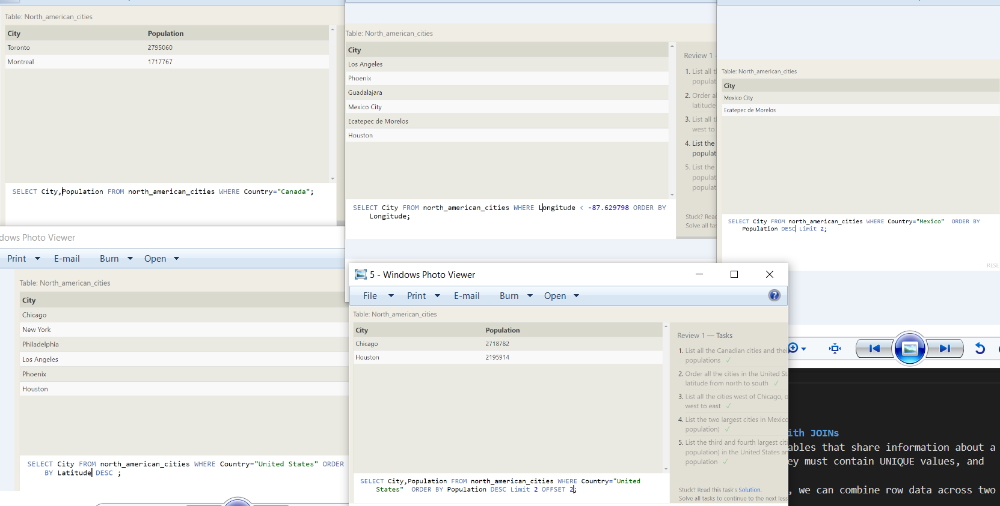
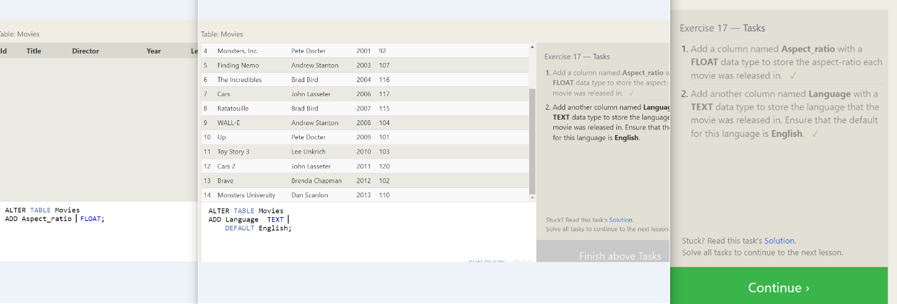

# SQL 
SQL is a domain-specific language used in programming and designed for managing data held in a relational database management system, or for stream processing in a relational data stream management system(two-dimensional tables). 
Columns being the properties and the rows being instances of the entity in the table. 

## SQL Lesson 1: SELECT queries 101

## SQL Lesson 2: Queries with constraints (Pt. 1)
Use WHERE for add condition checking specific column values to determine whether it should be included in the results or not so not return the all rows.
>**Opearator**

## SQL Lesson 3: Queries with constraints (Pt. 2)
Use WHERE with String data.
**Opearator**

## SQL Lesson 4: Filtering and sorting Query results
**DISTINCT** : returns only distinct (different) values in the result set
**ORDER BY** : used to sort the result set in ascending or descending order.
**LIMIT and OFFSET** : LIMIT used to specify the number of records to return, and OFFSET will specify where to begin counting the number rows from.

## SQL Review: Simple SELECT Queries

## SQL Lesson 6: Multi-table queries with JOINs
**Multi-table queries with JOINs** : Tables that share information about a single entity need to have a primary key must contain UNIQUE values, and cannot contain NULL values.
Using the ***JOIN*** clause in a query, we can combine row data across two separate tables using this unique key.
The **INNER JOIN** is a process that matches rows from the first table and the second table which have the same key (as defined by the **ON** constraint) to create a result row with the combined columns from both tables

## SQL Lesson 13: Inserting rows
 In SQL, the database schema is what describes the structure of each table, and the datatypes that each column of the table can contain.
 **INSERT INTO .. (Col1,Col2,..) VALUES (ValCol1 , ValCol2 , ..)** : Add new Data.

## SQL Lesson 14: Updating rows
 **UPDATE .. SET col=value.. WHERE..**: update existing data. 
 

## SQL Lesson 15: Deleting rows
 **DELETE FROM .. WHERE..** : delete data from a table.
 

## SQL Lesson 16: Creating tables
**CREATE TABLE IF NOT EXISTS ..(** column has a name, the type of data allowed in that column, an optional table constraint on values being inserted, and an optional default value)
**Data Type**

**Contstraint**

## SQL Lesson 17: Altering tables
**ALTER TABLE mytable
ADD column DataType OptionalTableConstraint 
    DEFAULT default_value;** : Adding columns.
    
**ALTER TABLE mytable
DROP column_to_be_deleted;** : Removing columns

**ALTER TABLE mytable
RENAME TO new_table_name;** : Rename Table.

## SQL Lesson 18: Dropping tables
**DROP TABLE IF EXISTS ..** : Delete Table. 

