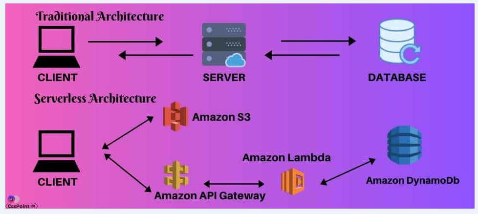
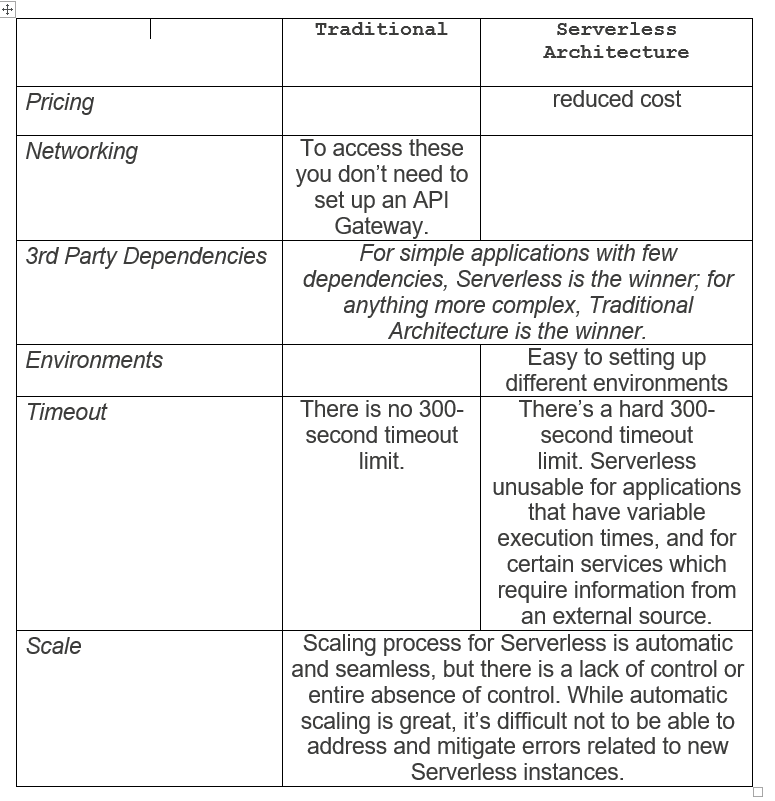
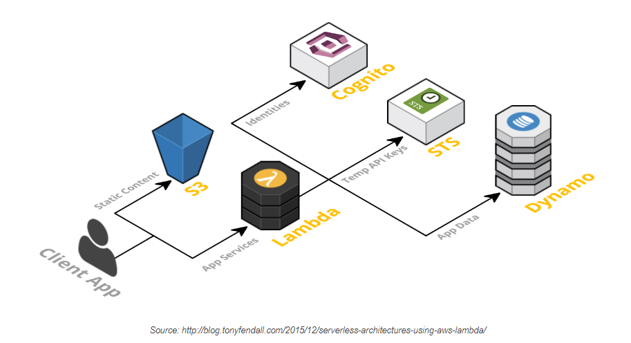

# Serverless and Amplify

### What is serverless?
* Serverless is a cloud computing execution model where the cloud provider dynamically manages the allocation and provisioning of servers.  
  
* Serverless providers:  
1. AWS Lambda  
2. Google Cloud Functions  
3. Azure Functions  
4. IBM OpenWhisk  
5. Alibaba Function Compute  
6. Iron Functions  
7. Auth0 Webtask  
8. Oracle Fn Project  
9. Kubeless  
  
### Traditional vs. Serverless Architecture
  
  
  

### The Serverless App
A Serverless solution consists of a web server, Lambda functions (FaaS), security token service (STS), user authentication and database.  
  
  
## AWS Amplify
* Build extensible, full-stack web and mobile apps faster. Easy to start, easy to scale.  

### API (GraphQL), Data Modeling
* **Setup database tables**  
@model will create a database table, and automatically add an id field as a primary key to the database table(you can override it by @primaryKey), also adds the helper fields createdAt and updatedAt to your type.  

Resources:  
[Intro to Serverless](https://hackernoon.com/what-is-serverless-architecture-what-are-its-pros-and-cons-cc4b804022e9)  
[AWS Amplify Kool-Aid](https://aws.amazon.com/amplify/)  
[GraphQL Intro (just read the first few paragraphs, up until the query code)](https://docs.amplify.aws/cli/graphql/data-modeling/#setup-database-tables)  
