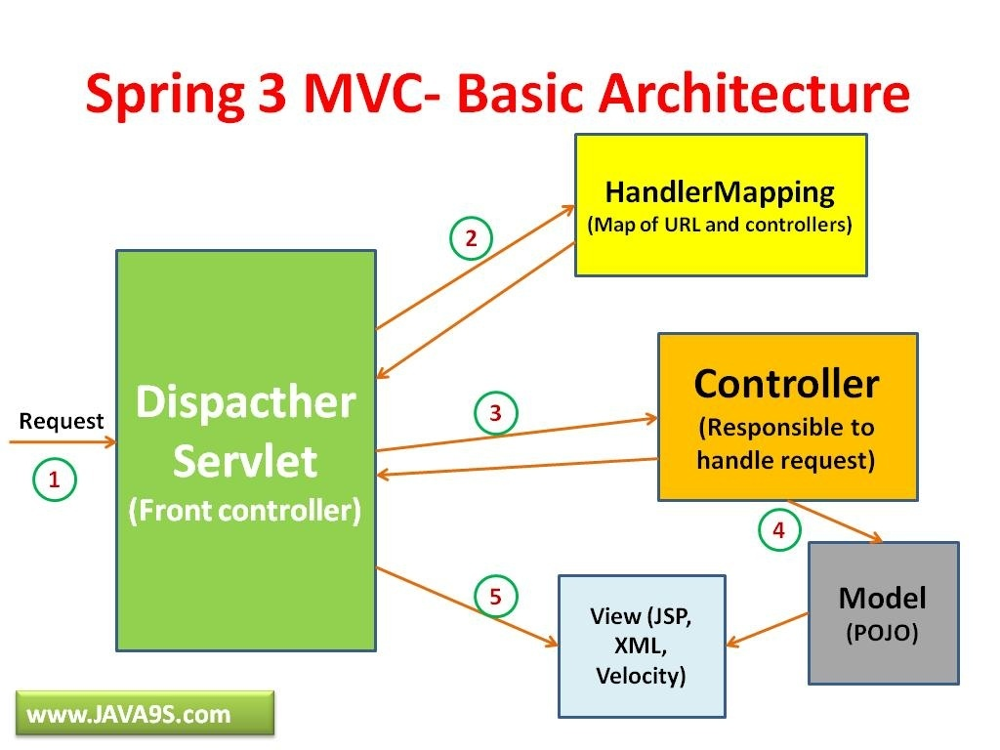

# Spring
<!-- https://en.wikipedia.org/wiki/Spring_Framework -->
The Spring Framework is an application framework and inversion of control container for the Java platform.  

* How starting with Spring Initializr?  
using [pre-initialized project](https://start.spring.io/)  
* Create a Web Controller
  
* Spring Boot Devtools  
It is a module offers by Spring to :   
    * Enables hot swapping.  

    * Switches template engines to disable caching.  

    * Enables LiveReload to automatically refresh the browser.  

    * Other reasonable defaults based on development instead of production.  
* Run the Application  
  
* Build an executable JAR  
We can run the App from the command line by using **./gradlew bootRun**. And we can build the JAR file by using **./gradlew build** and then run the JAR file **java -jar build/libs/gs-serving-web-content-0.1.0.jar**   

