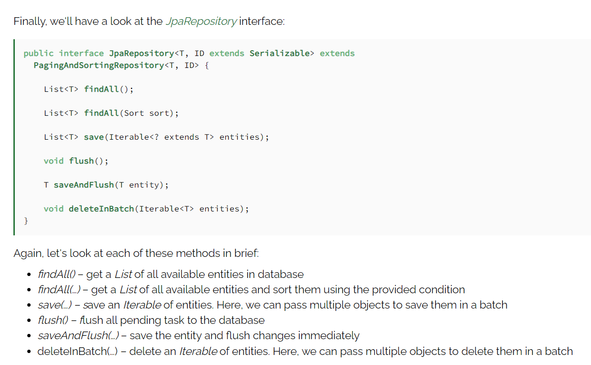
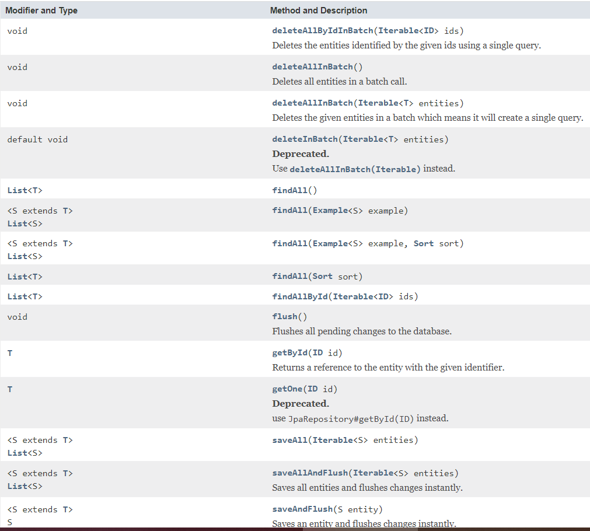

# Spring RESTful Routing & Static Files  
## How uses Spring Data JPA to store and retrieve data in a relational database?  
  
### How Define a Simple Entity?  
* we annotated the class with **@Entity**, indicating that it is a JPA entity. (Because no @Table annotation exists, it is assumed that this entity is mapped to a table named with this class name.)  
* The id property is annotated with **@Id** so that JPA recognizes it as the object’s ID. And also annotated with **@GeneratedValue** to indicate that the ID should be generated automatically when create object from this class.  
  
### How Create Simple Queries?  
* Create repository implementations automatically, at runtime, from a repository interface.  
By extending CrudRepository< TheClass,Long > or JpaRepository, ClassRepository inherits several methods for working with This Class persistence, including methods for saving, deleting, and finding the Class entities. And we can define a new query methods.  

### What the Methods for JpaRepository Interface ?  
<!-- https://www.baeldung.com/spring-data-repositories -->
  
  
  <!-- https://docs.spring.io/spring-data/data-jpa/docs/current/api/org/springframework/data/jpa/repository/JpaRepository.html -->

  
  
resources : 
* [Spring guide: Accessing Data with JPA](https://spring.io/guides/gs/accessing-data-jpa/)  
* [Baeldung: Comparing repositories](https://www.baeldung.com/spring-data-repositories)  
* [JpaRepository Interface](https://docs.spring.io/spring-data/data-jpa/docs/current/api/org/springframework/data/jpa/repository/JpaRepository.html)