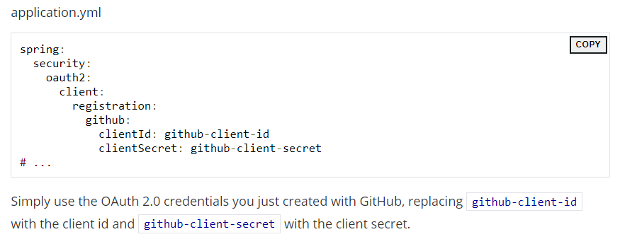

# Spring Boot and OAuth2
The samples are all single-page apps using Spring Boot and Spring Security on the back end.  
There are several samples building on each other, adding new features at each step:  

* simple: a very basic static app with just a home page and unconditional login via Spring Boot’s OAuth 2.0 configuration properties (if you visit the home page, you will be automatically redirected to GitHub).  

* click: adds an explicit link that the user has to click to login.  

* logout: adds a logout link as well for authenticated users.  

* two-providers: adds a second login provider so the user can choose on the home page which one to use.  

* custom-error: adds an error message for unauthenticated users, and a custom authentication based on GitHub’s API.   
  

The Application come up with a home page on http://localhost:8080 (and all require that you have at least a GitHub and Google account if you want to log in and see the content).  
  
### Single Sign On With GitHub
Application uses GitHub for authentication.  
How create the Application ?  
>* Creating a New Project : using [spring initilizr](https://start.spring.io/)   
>* Add a Home Page : create index.html, and to load the stylesheets you need to add those dependencies by adding jQuery and Twitter Bootstrap  
>* Securing the Application with GitHub and Spring Security : Add the Spring Security OAuth 2.0 Client starter dependency  
>* Configure the app to use GitHub as the authentication provider by : 
>> 1. [Add a New GitHub App](https://github.com/settings/developers)  
>> 2. Configure application.yml by adding :  
>>   
>> 3. Boot Up the Application  
### Add a Welcome Page
* **Conditional Content on the Home Page** : To render content on the condition that the user is authenticated, you have the option of either server-side or client-side rendering.  
* **Making the Home Page Public** : extends WebSecurityConfigurerAdapter and override the configure.  
* **Add a Logout Button** : add the logout button,it POST to /logout and then clears the dynamic content and in the configure add the /ogout route.  

  