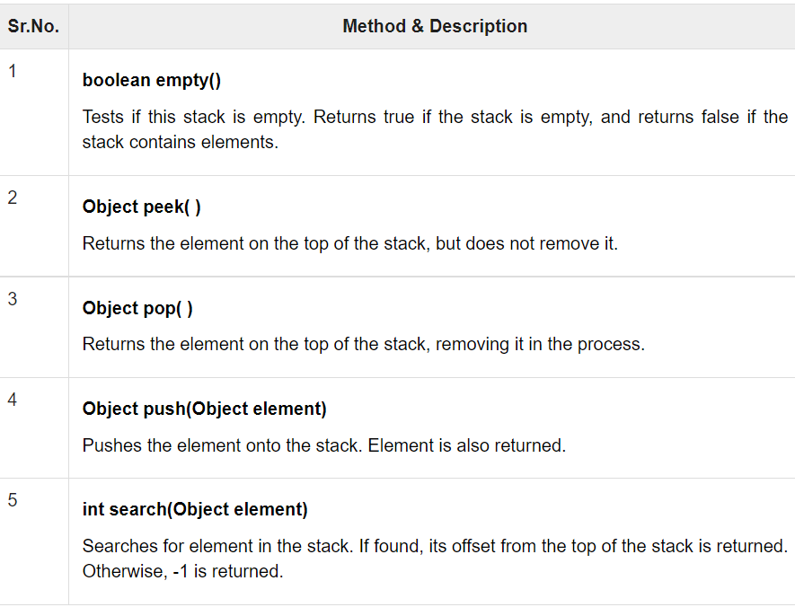
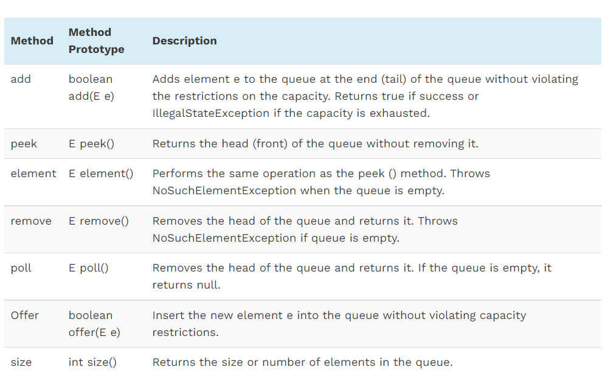
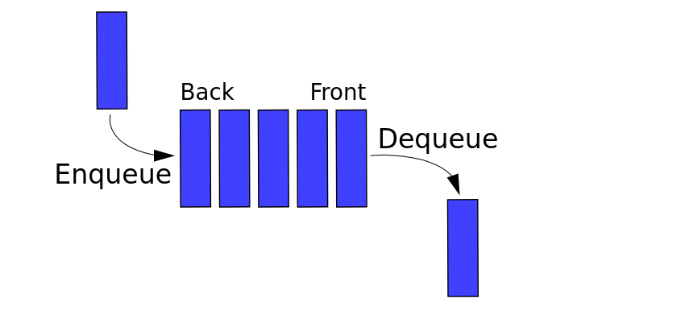

 # Stacks and Queues  
  
  
 ## What is the Stack ? 
 The stack is a linear data structure that is used to store the collection of objects.  
   

 ### What are the Methods for the Stack ?  
  <!-- https://www.tutorialspoint.com/java/java_stack_class.htm -->  
  
   
  
We must check **isEmpty** before we did a **pop and peek** to ensure not raising an exception.  
  
### What are the Concepts of the Stack ?   
* FILO : First In Last Out   
* LIFO : Last In First Out  

PUSH & POP :  
  
  
## What is the Queue ?  
A queue is a linear data structure or a collection in Java that stores elements in a FIFO (First In, First Out) order.  

### What are the Methods for the Queue ?  
<!-- https://www.softwaretestinghelp.com/java-queue-interface/#:~:text=A%20queue%20is%20a%20linear,and%20removed%20from%20the%20front. -->
  
  
We must check **isEmpty** before we did a **element, remove and peek** to ensure not raising an exception.  

### What are the Concepts of the Queue ?   
* FIFO : First In First Out    
* LILO : Last In Last Out  
  
  
  
