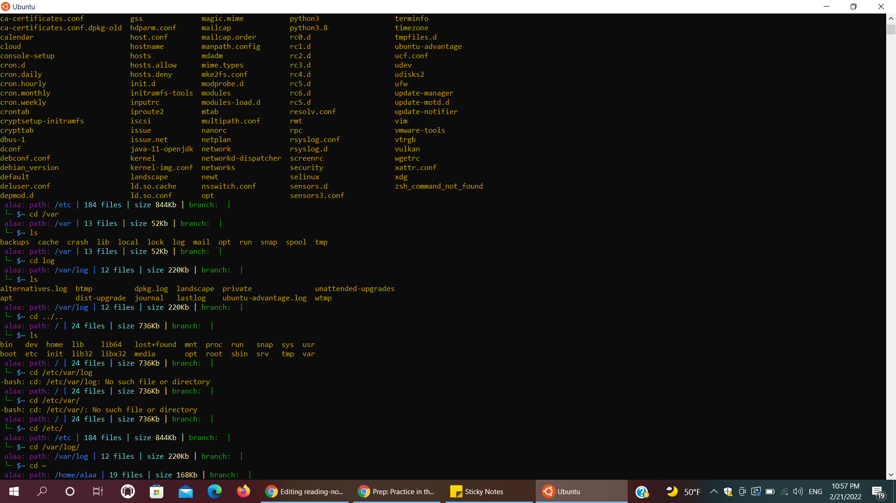
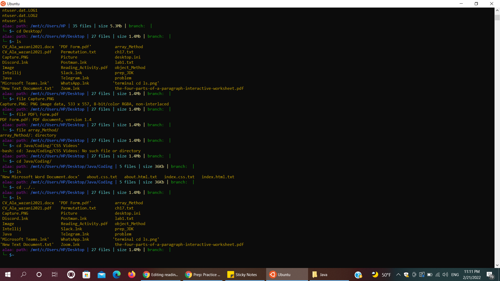
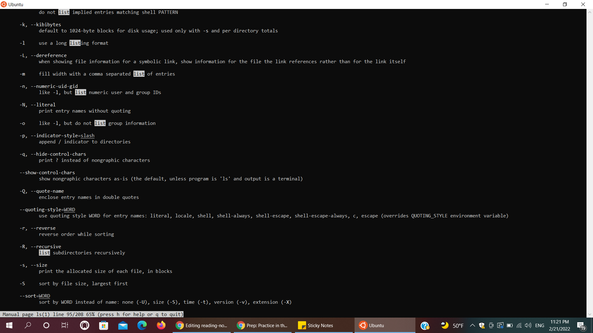
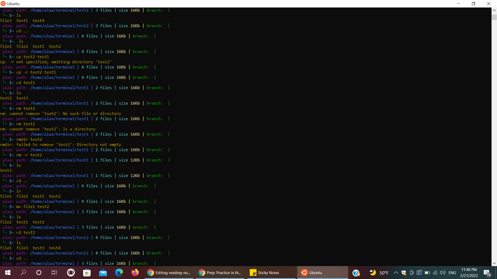

# Practice Terminal

## Terminal let us use many commands to do multiple things

### Commands Line
* ls [options] [location] command : it is a List command to List the files and directories inside the directory 
It takes a -l as a argument(option) to do long listing view the permissions and we can change this permissions by (chmod <permissions> <path>)
option -a so that it does show hidden files and directories,and also there is a many other arguments for deferent perpose.
* echo : command to display messages
* echo $SHELL : if we need to know the shell we use
* pwd : print work directory 
* cd [location] : to Change the Directory 
we can put the path as Absolute(the Full path to the file) or relative(only the file name)
~ (tilde) : home directory.
. (dot) : reference to your current directory. 
.. (dotdot): reference to the parent directory(you can go back )

* file [path] : used to determine the type of a file.
Note : For spaces in names we put whole path in quotes ( " ) or a backslash ( \ ) in front of spaces.

* man <command to look up> : Manual pages to explain the commands and the options it takes, and press 'q' for quit. And if you want to sreach within the manual press '/<term>' and Enter and use 'n' button for next.
  man -k <search term> : you can search for keyword if you are not sure what is the command you want.

* mkdir [options] <DirectoryName> : Creating a directory.
  and it takes -p option : to make parent directory as needed, and if you want to see what happened add -v option
 * rmdir [options] <Directory> : Remove Empty dirctory.
 * rm [options] <file> : Remove a File and non-empty directory we use -r option.
 * touch [options] <filename> : create a blank file.
 * cp [options] <source> <destination> : copy file or Directory.
  -r option : is to copy the directory and any files or directories within that directory.
 * mv [options] <source> <destination> : Move a file or directory.And we can use this command as Rename if we make the sourse and destinationsame directory but in different name.
 
 ### Process Management
  * ps : list of the processes with their id's 
  * kill <process id> : cancel the process.
  * jobs : List the current processes in the background.
  * fg <job number> : Move the given process from the background to the foreground.
  * CTRL + C : Cancel the currently running process.
  * CTRL + Z : Pause the currently running process and put it in the background.

  
