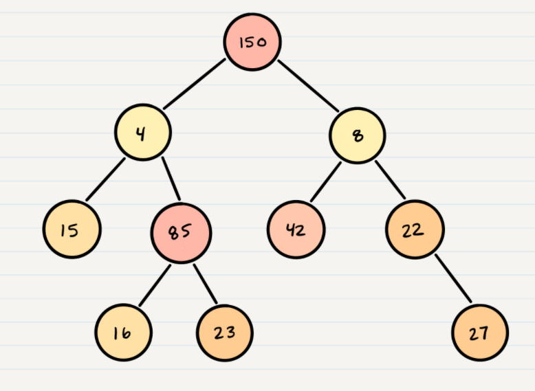
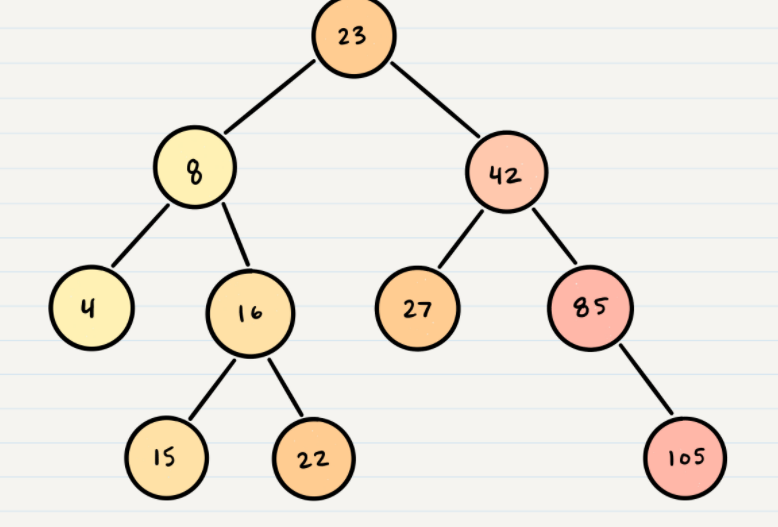
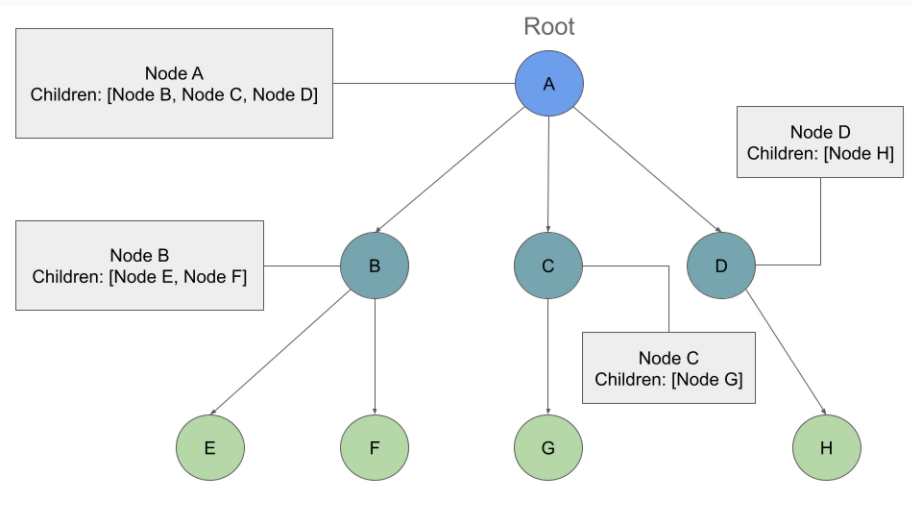
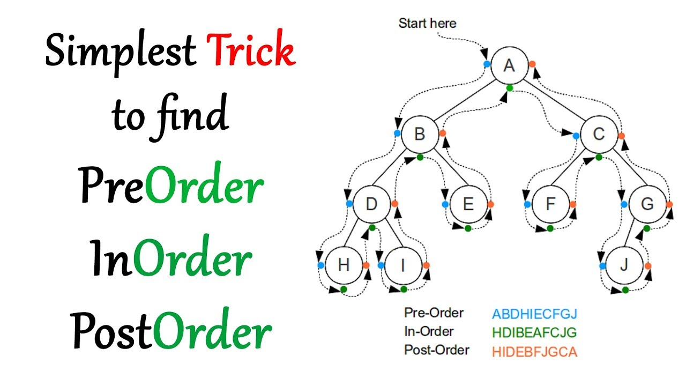
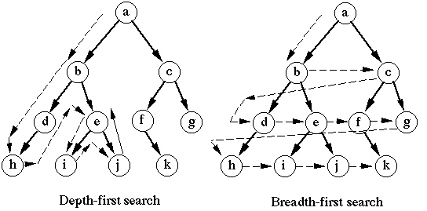

# Tree  
A tree is a widely used abstract data type that simulates a hierarchical tree structure(non-liner), with a root value and subtrees of children with a parent node, represented as a set of linked nodes.  
  
### The Type of Tree  
* Binary Trees: the number of children for the Nodes are two  
  
* Binary Search Trees: all values that are smaller than the root are placed to the left, and all values that are larger than the root are placed to the right.  
  
* K-ary Trees: Nodes are able have more than 2 child nodes  
  
  
### Common Terminology
* **Node** - A Tree node is a component which may contain its own values, and references to other nodes  
* **Root** - The root is the node at the beginning of the tree  
* **K** - A number that specifies the maximum number of children any node may have in a k-ary tree. In a binary tree, k = 2.  
* **Left** - A reference to one child node, in a binary tree  
* **Right** - A reference to the other child node, in a binary tree  
* **Edge** - The edge in a tree is the link between a parent and child node  
* **Leaf** - A leaf is a node that does not have any children   
* **Height** - The height of a tree is the number of edges from the root to the furthest leaf  
  
### Traversals  
* Tree traversal means visiting each node of the tree buy two categories:  
> #### 1. Depth First  
> The three methods for depth first traversal(Using stack):  
> * **Pre-order** : root >> left >> right  
> * **In-order** : left >> root >> right  
> * **Post-order** : left >> right >> root  
>   
   
>#### 2. Breadth First    
> Breadth first traversal iterates through the tree by going through each level of the tree node-by-node(We use Queue for that)  
  
  
  
[Video](https://www.youtube.com/watch?v=IpyCqRmaKW4)  
Resources: [Tree](https://codefellows.github.io/common_curriculum/data_structures_and_algorithms/Code_401/class-15/resources/Trees.html)

