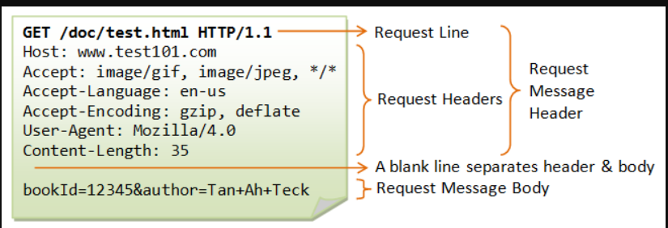

# WRRC and Java 
   
## The HTTP Request Lifecycle
* The browser extracts the "scheme"/protocol ( <protocol>://<host><:optional port>/<path/to/resource><?query> )  
* Then the browser send DNS request using UDP and get the IP address for the hostname in the DNS response.  
* Establish a TCP connection 
  
* Send HTTP request 
  
* Close the connection  
  

## Java HTTP Request
* In java we use HttpUrlConnection class to make the connection with the URL.  
* use setRequest Method to set the requestMethod attribute to one of the values: GET, POST, HEAD, OPTIONS, PUT, DELETE, TRACE.  
* Reading the Response 

