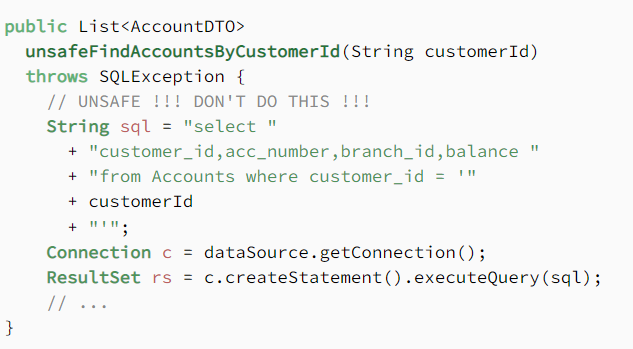
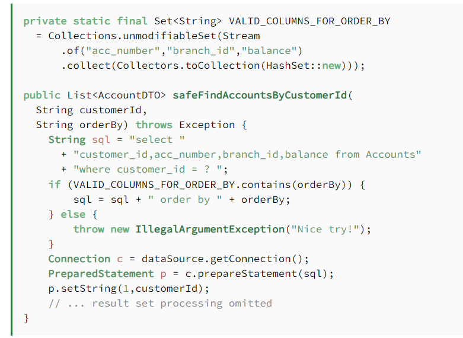
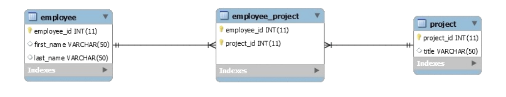
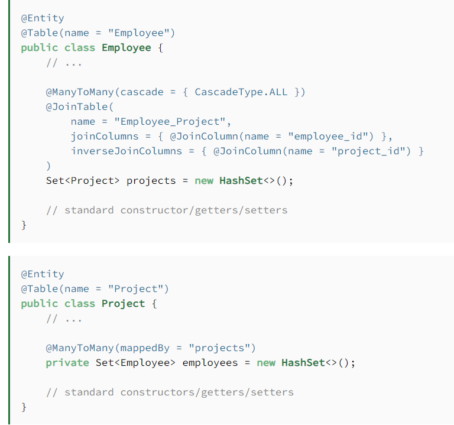

# Web App Security  
  
## sanitized Input  
we can have many injections to our code by HTML and sql.  

* We must user Cleaning Content  
Not all HTML tags or attributes are dangerous,so it might make sense for you to allow some HTML, as long as you don’t allow the dangerous stuff. For example you might want to allow p , th:text and ul tags, but not script, th:utext or iframe tags.  
* SQL query  
**Unsafe Query**    
  
**Safe Query**    
  
  
## Many-To-Many  
**What is the realationship**    
  
**How do it in the Model classes**    
  

  
 Resources : [Mant-to-Many](https://www.baeldung.com/hibernate-many-to-many) 